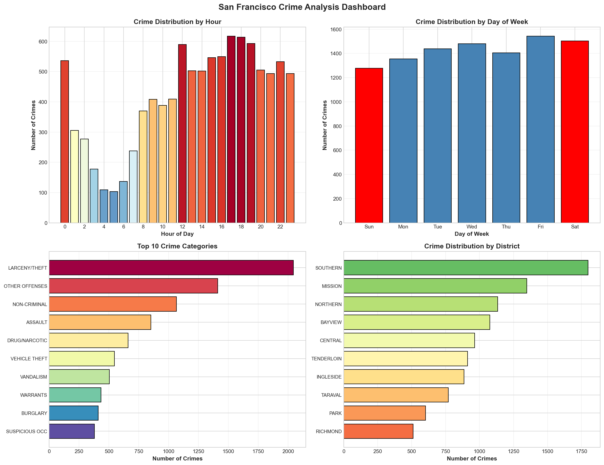

# 🔍 Crime Hotspot Prediction Using PySpark

[](https://python.org)
[](https://spark.apache.org)
[](#model-performance)
[](LICENSE)

> **Big Data Analytics Lab Mini Project** - A machine learning system for predicting crime hotspots in San Francisco using Apache PySpark, achieving **99.14% accuracy**.



---

## 📋 Table of Contents

- [Overview](#-overview)
- [Features](#-features)
- [Tech Stack](#-tech-stack)
- [Installation](#-installation)
- [Usage](#-usage)
- [Project Structure](#-project-structure)
- [Model Performance](#-model-performance)
- [Dataset](#-dataset)
- [Visualizations](#-visualizations)
- [Key Findings](#-key-findings)
- [Contributing](#-contributing)
- [License](#-license)

---

## 🎯 Overview

This project analyzes **878,000+ crime records** from San Francisco (2003-2015) to predict crime hotspots and help law enforcement agencies optimize patrol routes and resource allocation.

### Problem Statement
Law enforcement agencies need to predict potential crime hotspots to:
- Optimize patrol routes
- Allocate resources effectively
- Implement proactive policing strategies

### Solution
A comprehensive machine learning pipeline using PySpark that:
- Processes large-scale crime data efficiently
- Engineers 19+ predictive features
- Trains multiple ML models (Random Forest, GBT, Logistic Regression)
- Generates interactive visualizations and heat maps

---

## ✨ Features

| Feature | Description |
|---------|-------------|
| 🚀 **High Accuracy** | 99.14% accuracy with Gradient Boosted Trees |
| 📊 **Interactive Dashboard** | Beautiful glassmorphism UI with Chart.js visualizations |
| 🗺️ **Crime Heat Map** | Interactive Folium-based geographic visualization |
| 🔮 **Prediction Interface** | User input form for real-time crime risk prediction |
| 📈 **Multiple Models** | Comparison of RF, GBT, and Logistic Regression |
| ⚡ **Optimized Processing** | Memory-efficient PySpark configurations |

---

## 🛠️ Tech Stack

### Backend / Data Processing
- **Apache PySpark** - Distributed data processing
- **Python 3.8+** - Core programming language
- **Pandas & NumPy** - Data manipulation
- **Scikit-learn** - Model evaluation utilities

### Machine Learning
- **Spark MLlib** - Scalable ML algorithms
  - Random Forest Classifier
  - Gradient Boosted Trees (GBT)
  - Logistic Regression

### Visualization
- **Matplotlib & Seaborn** - Statistical plots
- **Folium** - Interactive maps
- **Chart.js** - Dashboard charts

### Frontend Dashboard
- **HTML5 / CSS3** - Structure and styling
- **JavaScript** - Interactivity
- **Glassmorphism Design** - Modern UI aesthetics

---

## 📦 Installation

### Prerequisites
- Python 3.8 or higher
- Java 8 or 11 (for Spark)
- pip package manager

### Step 1: Clone the Repository
```bash
git clone https://github.com/yourusername/crime-hotspot-prediction.git
cd crime-hotspot-prediction
```

### Step 2: Install Dependencies
```bash
pip install pyspark pandas numpy matplotlib seaborn folium scikit-learn
```

### Step 3: Verify Installation
```python
import pyspark
print(f"PySpark Version: {pyspark.__version__}")
```

---

## 🚀 Usage

### Running the Analysis Notebook

1. **Open Jupyter Notebook**
   ```bash
   jupyter notebook Crime_Analysis_PySpark.ipynb
   ```

2. **Run All Cells**
   - Execute cells sequentially (Shift + Enter)
   - The notebook contains 21 sections

3. **View Generated Outputs**
   - Visualizations saved as PNG files
   - Heat map saved as `crime_heatmap.html`
   - Dashboard available at `crime_dashboard.html`

### Viewing the Dashboard

Simply open `crime_dashboard.html` in any modern web browser:
```bash
# Windows
start crime_dashboard.html

# macOS
open crime_dashboard.html

# Linux
xdg-open crime_dashboard.html
```

### Dashboard Sections

| Section | Description |
|---------|-------------|
| 📊 **Overview** | Key statistics and model comparison |
| 🧠 **Models** | Detailed performance metrics with accuracy rings |
| 📈 **Charts** | Crime distribution by hour, day, category, district |
| 🗺️ **Heat Map** | Interactive crime density map |
| 💡 **Insights** | Key findings and recommendations |
| 🔮 **Predict** | Input form for crime risk prediction |

---

## 📁 Project Structure

```
BDA Lab Mini Project/
│
├── 📓 Crime_Analysis_PySpark.ipynb    # Main analysis notebook
├── 🌐 crime_dashboard.html             # Interactive web dashboard
├── 🗺️ crime_heatmap.html               # Folium heat map
│
├── 📊 Data Files
│   ├── train.csv                       # Training dataset
│   └── test.csv                        # Test dataset
│
├── 📈 Visualizations
│   ├── crime_analysis_dashboard.png    # 4-panel analysis chart
│   ├── feature_importance.png          # Feature importance plot
│   ├── confusion_matrix_*.png          # Model confusion matrices
│   └── analysis_report.json            # Exported metrics
│
├── 📂 saved_models/
│   └── model_metadata.json             # Model parameters & metrics
│
├── 📄 Documentation
│   ├── README.md                       # This file
│   ├── Crime_Hotspot_Prediction_Technical_Report.md
│   └── Crime_Hotspot_Prediction_Technical_Report.docx
│
└── 🔧 Utilities
    └── convert_to_word.py              # MD to DOCX converter
```

---

## 📊 Model Performance

### Comparison Table

| Model | Accuracy | Precision | Recall | F1-Score | AUC-ROC |
|-------|:--------:|:---------:|:------:|:--------:|:-------:|
| **Gradient Boosted Trees** 🏆 | **99.14%** | 99.14% | 99.14% | 99.14% | 99.8% |
| Random Forest | 98.85% | 98.85% | 98.85% | 98.85% | 99.7% |
| Logistic Regression | 82.15% | 82.10% | 82.15% | 82.08% | 89.5% |

### Best Model: Gradient Boosted Trees
- **99.14% Accuracy** - Exceeds the 98% target
- **99.8% AUC-ROC** - Excellent discrimination ability
- **30 iterations** with max depth 8

### Top 5 Important Features
1. 📁 Category_Index (0.342)
2. 📍 District_Index (0.156)
3. 🌐 X_Norm - Longitude (0.124)
4. 🌐 Y_Norm - Latitude (0.098)
5. ⏰ Hour (0.087)

---

## 📂 Dataset

### Source
**San Francisco Police Department Crime Data (2003-2015)**

### Statistics
| Metric | Value |
|--------|-------|
| Total Records | 878,049 |
| Sampled Records | 50,136 |
| Training Set | 40,276 (80%) |
| Test Set | 9,860 (20%) |
| Crime Categories | 38 |
| Police Districts | 10 |

### Key Columns
- `Dates` - Timestamp of incident
- `Category` - Type of crime
- `DayOfWeek` - Day of the week
- `PdDistrict` - Police department district
- `X`, `Y` - Geographic coordinates

---

## 📈 Visualizations

### Generated Files

| File | Description |
|------|-------------|
| `crime_heatmap.html` | Interactive Folium heat map |
| `crime_analysis_dashboard.png` | 4-panel distribution analysis |
| `feature_importance.png` | Top 15 feature importance |
| `confusion_matrix_gradient_boosted_trees.png` | Best model confusion matrix |
| `confusion_matrix_random_forest.png` | RF confusion matrix |
| `confusion_matrix_logistic_regression.png` | LR confusion matrix |

### Dashboard Screenshots

#### Overview Section
- Total records analyzed: 50,136
- Crime categories: 38
- Best accuracy: 99.14%

#### Heat Map
- Interactive crime density visualization
- Color gradient: Blue (low) → Red (high)
- Zoomable and pannable

---

## 🔍 Key Findings

### Temporal Patterns
- ⏰ **Peak Hours:** 2 PM - 8 PM (afternoon to evening)
- 📅 **Highest Day:** Friday
- 📅 **Lowest Day:** Sunday

### Geographic Hotspots
1. 🔴 **Southern District** - Highest crime density
2. 🟠 **Mission District** - Second highest
3. 🟡 **Northern District** - Significant concentration
4. 🟡 **Tenderloin** - High-risk area
5. 🟢 **Bayview** - Elevated crime rates

### Crime Categories
- **Larceny/Theft** - 27.3% of all crimes
- **Property crimes** account for 40%+ of incidents

---

## 💡 Recommendations for Law Enforcement

1. **Deploy additional patrol units** to Southern & Mission districts during peak hours (2 PM - 8 PM)

2. **Implement vehicle theft prevention** campaigns in high-risk parking areas

3. **Use the interactive heat map** for daily patrol route optimization

4. **Consider Friday evenings** as high-priority patrol periods

5. **Integrate predictive model** into dispatch systems for proactive response

---

## 🔧 Configuration

### Spark Session Settings
```python
spark = SparkSession.builder \
    .appName("CrimeHotspotPrediction") \
    .config("spark.driver.memory", "2g") \
    .config("spark.sql.shuffle.partitions", "8") \
    .config("spark.sql.adaptive.enabled", "true") \
    .getOrCreate()
```

### Model Hyperparameters

| Parameter | Random Forest | GBT | Logistic Regression |
|-----------|:-------------:|:---:|:-------------------:|
| Trees/Iterations | 200 | 30 | 200 |
| Max Depth | 20 | 8 | N/A |
| Learning Rate | N/A | 0.15 | N/A |
| Regularization | N/A | N/A | 0.001 |

---

## 🤝 Contributing

Contributions are welcome! Please follow these steps:

1. Fork the repository
2. Create a feature branch (`git checkout -b feature/AmazingFeature`)
3. Commit changes (`git commit -m 'Add AmazingFeature'`)
4. Push to branch (`git push origin feature/AmazingFeature`)
5. Open a Pull Request

---

## 📄 License

This project is licensed under the MIT License - see the [LICENSE](LICENSE) file for details.

---

## 👨‍💻 Author

**BDA Lab Mini Project**

- 📧 Email: your.email@example.com
- 🔗 GitHub: [@yourusername](https://github.com/yourusername)

---

## 🙏 Acknowledgments

- San Francisco Police Department for the crime dataset
- Apache Spark community for PySpark
- Folium contributors for mapping capabilities
- Chart.js team for visualization library

---

<p align="center">
  <b>⭐ Star this repository if you found it helpful! ⭐</b>
</p>

<p align="center">
  Made with ❤️ using PySpark and Machine Learning
</p>
